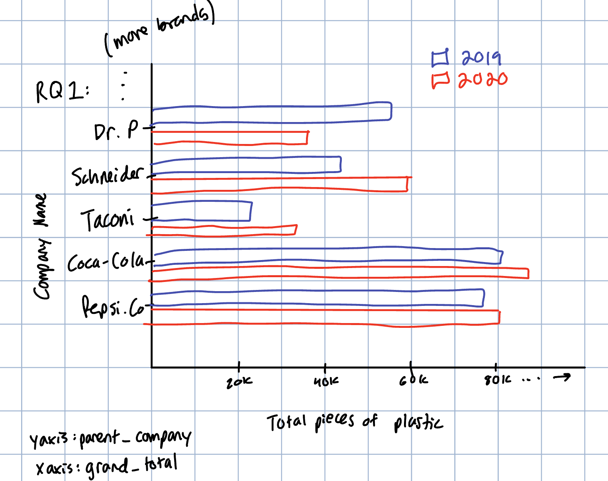
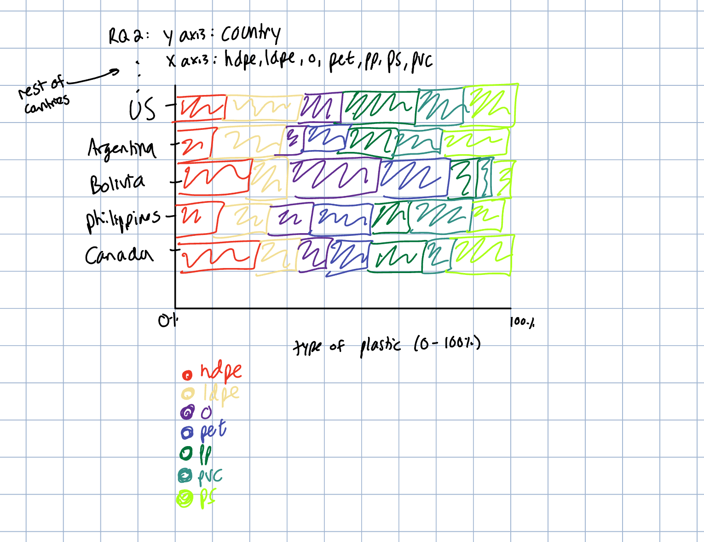

## Data

Reading in the Plastic Waste Data

```{r}
#install.packages("tidytuesdayR")
library(tidytuesdayR)

tuesdata <- tidytuesdayR::tt_load('2021-01-26')
tuesdata <- tidytuesdayR::tt_load(2021, week = 5)

plastics <- tuesdata$plastics

```

## **By the end of the week, you should have a draft report which:**

1.  describes the context of the data

This dataset comes from Break Free From Plastic, where a global movement holding corporations accountable for the plastic waste their products generate. The volunteers around the world would help with collecting and categorizing plastic waste found in their communities by manufacturer and plastic type. The data covers 2019 and 2020 cycles, where they recorded the parent company responsible for each piece of plastic, and the number of volunteers and collection events per country. The combined dataset contains one row per parent company per country per year, with plastic counts broken out by resin type alongside a grand total.

2.  explains what cleaning has been done to the data

The raw data for each year were CSV files for 2019 and 2020, which were merged into one dataset. The 2019 files had duplicate polypropylene and polystyrene columns that were combined and removed, and the 2020 grand total column was as a character column that needed to be converted to a number. Column names also differed between the two years and were standardized before combining.

3.  research questions that could be addressed with these data

Which parent companies are responsible for the greatest share of plastic waste globally?

Which plastic waste types dominate in the different countries recorded on?

4.  research questions that could be addressed using supplemental data

Do countries with plastic bag bans or recycling laws have less plastic waste found during cleanups?

Do wealthier countries tend to have more water/soda container plastic compared to poorer countries?

5.  sketches out two visualizations that could be made to address the research questions you posed above

    Graph 1: Different Companies by year on total plastic waste

    Graph 2: Types of plastic waste by contry.

{width="900"}


